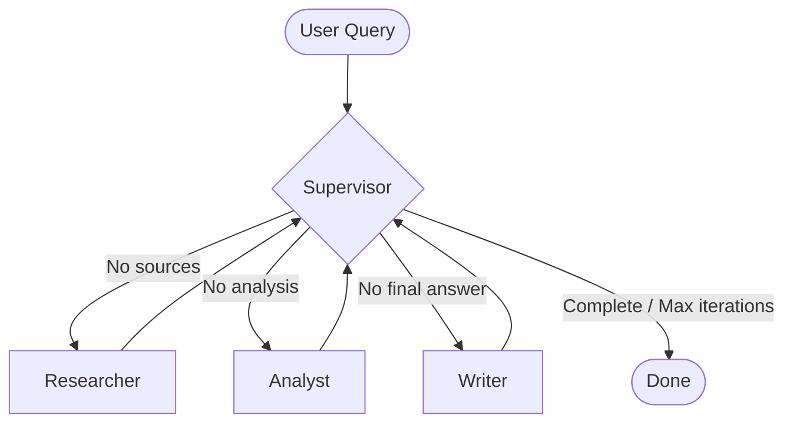

# Design Template

## Problem

Nghiên cứu các chủ đề kỹ thuật phức tạp (ví dụ: GraphRAG state-of-the-art), tổng hợp tài liệu, phân tích độ tin cậy của các phát biểu và biên soạn báo cáo kỹ thuật hoàn chỉnh kèm nguồn trích dẫn.

## Why multi-agent?

Single-agent (monolithic pass) thường gặp các hạn chế:
1. Context window bị loãng khi vừa phải tìm nguồn, vừa phân tích, vừa viết báo cáo.
2. Dễ xuất hiện hallucination và thiếu trích dẫn cụ thể.
3. Không thể phân tách trách nhiệm kiểm tra độc lập giữa khâu thu thập thông tin và khâu đánh giá chất lượng.

Multi-agent phân tách bài toán thành các vai trò chuyên biệt (Supervisor, Researcher, Analyst, Writer, Critic) giúp nâng cao độ chính xác, tăng citation coverage và dễ kiểm soát lỗi.

## Agent roles

| Agent | Responsibility | Input | Output | Failure mode |
|---|---|---|---|---|
| Supervisor | Điều phối luồng làm việc, quyết định agent tiếp theo hoặc hoàn thành | Shared ResearchState | Tên agent tiếp theo (`route_history`) | Vòng lặp vô hạn nếu thông tin thiếu |
| Researcher | Tìm kiếm nguồn tài liệu web/ArXiv và tổng hợp ghi chú | `request.query` | `sources`, `research_notes` | Không tìm thấy nguồn hoặc API rate limit |
| Analyst | Đánh giá phản biện, trích xuất luận điểm chính | `research_notes` | `analysis_notes` | Nhận xét hời hợt hoặc bỏ sót thông tin |
| Writer | Tổng hợp báo cáo cuối cùng kèm trích dẫn markdown | `research_notes`, `analysis_notes`, `sources` | `final_answer` | Quên chèn trích dẫn hoặc sai định dạng |
| Critic | Rà soát kiểm tra lỗi thực tế và hallucination | `final_answer`, `sources` | Verification notes trong `agent_results` | Đánh giá quá khắt khe hoặc bỏ qua lỗi |

## Shared state

- `request`: Thông tin query, max_sources, audience.
- `iteration`: Đếm số vòng lặp supervisor.
- `route_history`: Lưu danh sách các bước agent đã gọi.
- `sources`: Danh sách `SourceDocument` (title, url, snippet).
- `research_notes`: Ghi chú thô từ Researcher.
- `analysis_notes`: Ghi chú phân tích phản biện từ Analyst.
- `final_answer`: Báo cáo cuối cùng do Writer tạo.
- `agent_results`: Danh sách các kết quả chi tiết từng agent.
- `trace`: Log tracing chi tiết của hệ thống.
- `errors`: Danh sách các lỗi phát sinh.

## Routing policy

## Guardrails

- Max iterations: Gioạn tối đa 6 vòng lặp supervisor (`MAX_ITERATIONS=6`).
- Timeout: Tối đa 60 giây cho mỗi lượt gọi (`TIMEOUT_SECONDS=60`).
- Retry: Tự động fallback routing trong Supervisor nếu LLM không trả đúng format.
- Fallback: Trả về Mock search kết quả phong phú nếu Search API không khả dụng hoặc lỗi SSL.
- Validation: Kiểm tra Pydantic schema cho `ResearchQuery`, `ResearchState`, và `BenchmarkMetrics`.

## Benchmark plan

- Query thử nghiệm: `"Research GraphRAG state-of-the-art and write a summary"`
- Metrics:
  - Latency (giây): Wall-clock time execution.
  - Quality Score (0-10): Chấm điểm mức độ hoàn thiện của thông tin.
  - Citation Coverage (0-100%): Tỷ lệ các nguồn được trích dẫn trong bài viết.
  - Failure Rate (0-100%): Tỷ lệ câu lệnh thất bại.
- Expected outcome: Multi-agent đạt Quality 10.0 và Citation Coverage 100%, vượt trội so với Single-agent baseline.
